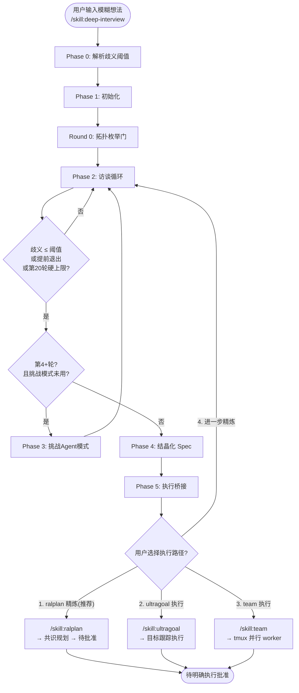
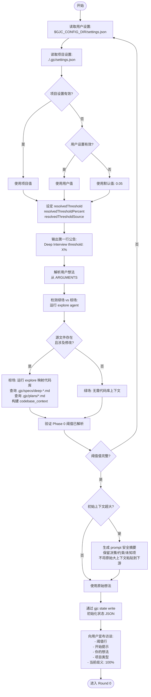
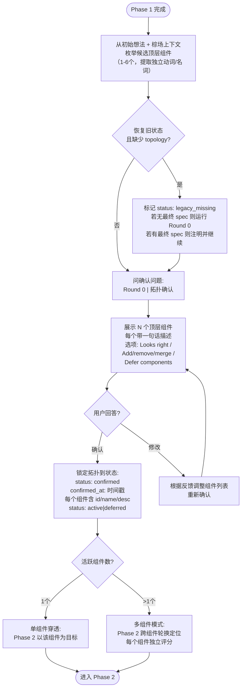
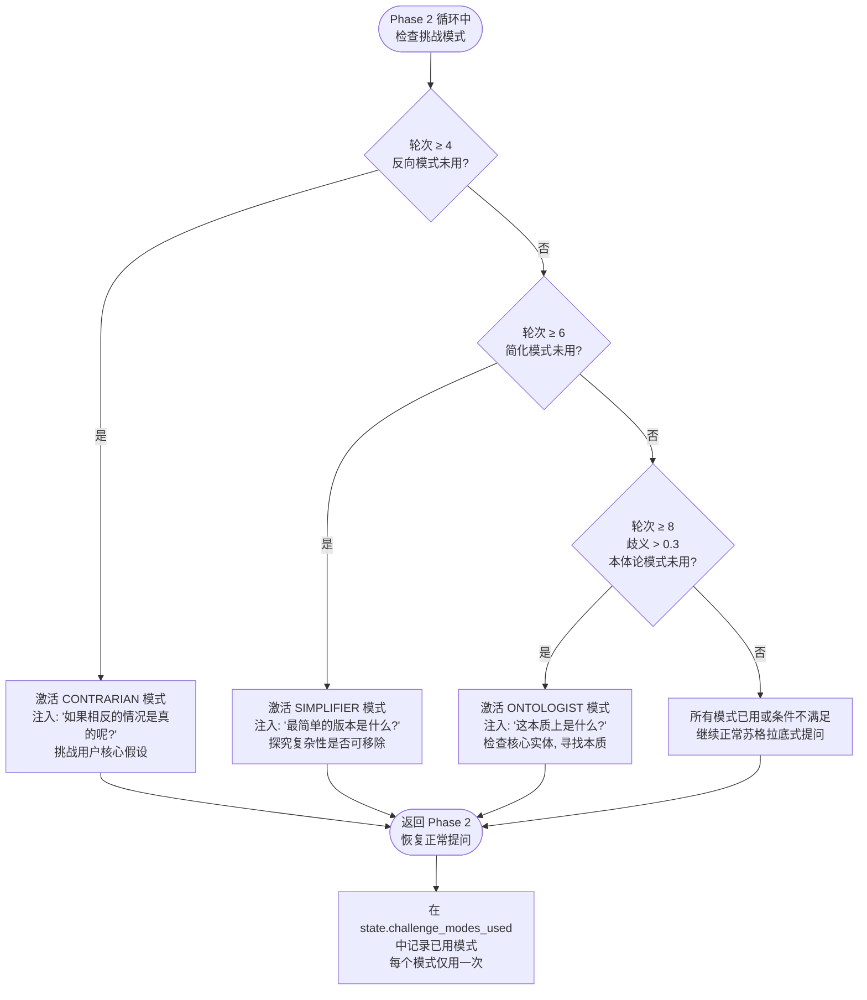
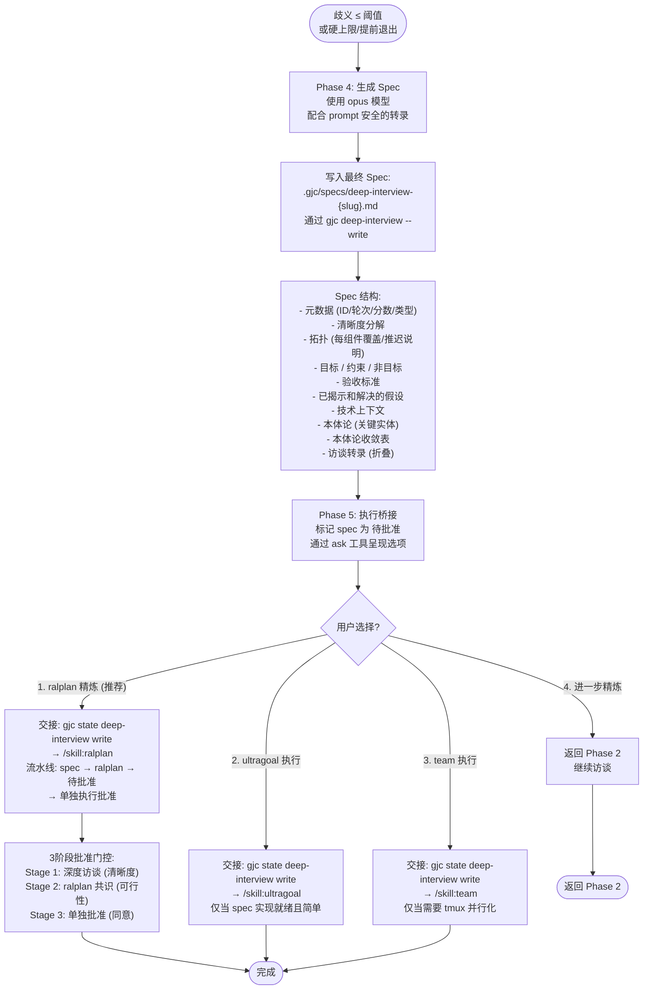

# Deep-Interview 流程图

> 苏格拉底式深度访谈 — 将模糊需求通过追问转化为具体规格

---

## 1a: 总览 — Phase 0 → Phase 5 顶层流程

---

## 1b: Phase 0-1 — 阈值解析 + 初始化

---

## 1c: Round 0 — 拓扑枚举门

---

## 1d: Phase 2 — 访谈循环（核心）

```mermaid
flowchart TD
    START(["Round 0 完成"]) --> P2_LOOP["Step 2a: 生成下一个问题"]
    
    P2_LOOP --> P2_STRATEGY["定位策略:<br/>1. 找最弱活跃组件+维度<br/>2. N>1 时跨组件轮换<br/>3. 生成针对性问题<br/>4. 范围模糊→本体论风格"]
    
    P2_STRATEGY --> P2A_CHECK{"绿场且标记<br/>research: true?"}
    P2A_CHECK -->|"是"| P2A_AUTO["Step 2a': 自动研究<br/>加载 auto-research-greenfield.md<br/>架构师返回 2-3 排名候选<br/>纳入问题选项"]
    P2A_CHECK -->|"否"| P2B
    P2A_AUTO --> P2A_VALID{"响应有效?"}
    P2A_VALID -->|"是"| P2B["Step 2b: 使用 ask 工具提问<br/>Round {n} | 组件: {name}<br/>定位: {dimension} | 歧义: {score}%"]
    P2A_VALID -->|"否"| P2A_FAIL["递增 architect_failures<br/>回退到正常问题"]
    P2A_FAIL --> P2B
    
    P2B --> P2B_ANSWER["用户回答 / 跳过"]
    P2B_ANSWER --> P2B_CHECK{"用户跳过<br/>或要求 agent 决定?"}
    P2B_CHECK -->|"是"| P2B_AUTO["Step 2b': 自动回答<br/>加载 auto-answer-uncertain.md<br/>架构师返回决定性答案<br/>清晰度上限: 0.85"]
    P2B_CHECK -->|"否"| P2C
    P2B_AUTO --> P2B_VALID{"响应有效?"}
    P2B_VALID -->|"是"| P2B_CAP["应用清晰度上限<br/>若跨阈值则要求用户确认"]
    P2B_VALID -->|"否"| P2B_FAIL["递增 architect_failures<br/>视为未解决差距"]
    P2B_CAP --> P2C
    P2B_FAIL --> P2C
    
    P2C["Step 2c: 评分歧义<br/>使用 opus 模型, temp 0.1"]
    P2C --> P2C_SCORE["评分每个活跃组件每维度:<br/>- 目标清晰度 (0-1)<br/>- 约束清晰度 (0-1)<br/>- 成功标准 (0-1)<br/>- 上下文清晰度 (仅棕场)"]
    
    P2C_SCORE --> P2C_CALC["计算歧义:<br/>绿场: 1-(goal×0.40 + constraints×0.30 + criteria×0.30)<br/>棕场: 1-(goal×0.35 + constraints×0.25 + criteria×0.25 + context×0.15)"]
    
    P2C_CALC --> P2C_ONTO["本体论提取:<br/>- 识别所有关键实体<br/>- Round 1: 所有实体为 new<br/>- Round 2+: 比较稳定性<br/>  stable/changed/new/removed<br/>  stability_ratio = (stable+changed)/total"]
    
    P2C_ONTO --> P2D["Step 2d: 报告进度<br/>- 维度分数表<br/>- 拓扑状态<br/>- 本体论稳定性<br/>- 下一个目标"]
    
    P2D --> P2E["Step 2e: 更新状态<br/>通过 gjc state write"]
    
    P2E --> P2F["Step 2f: 检查软限制"]
    P2F --> P2F_CHECK{"当前轮次?"}
    P2F_CHECK -->|"第3+轮, 用户说够了"| P2F_EARLY["允许提前退出<br/>歧义>阈值时警告"]
    P2F_CHECK -->|"第10轮"| P2F_SOFT["软警告: 已10轮<br/>继续还是前进?"]
    P2F_CHECK -->|"第20轮"| P2F_HARD["硬上限: 以当前清晰度继续"]
    P2F_CHECK -->|"其他"| P2F_NEXT{"歧义 ≤ 阈值?"}
    
    P2F_SOFT --> P2F_NEXT
    P2F_NEXT -->|"是"| P3_CHECK(["进入 Phase 3 检查"])
    P2F_NEXT -->|"否"| P2F_STAG{"连续3轮<br/>歧义停滞?"}
    P2F_STAG -->|"是"| P2F_ONTO["激活本体论模式<br/>重新框架"]
    P2F_STAG -->|"否"| P2F_DIM{"所有维度 ≥0.9?"}
    P2F_DIM -->|"是"| P3_CHECK
    P2F_DIM -->|"否"| P2_LOOP
    P2F_ONTO --> P2_LOOP
```

---

## 1e: Phase 3 — 挑战 Agent 模式

---

## 1f: Phase 4-5 — Spec 结晶化 + 执行桥接

---

## 维度权重参考

| 维度 | 绿场权重 | 棕场权重 |
|------|---------|---------|
| 目标清晰度 | 40% | 35% |
| 约束清晰度 | 30% | 25% |
| 成功标准 | 30% | 25% |
| 上下文清晰度 | N/A | 15% |

## 挑战 Agent 模式触发条件

| 模式 | 激活轮次 | 条件 | 目的 |
|------|---------|------|------|
| 反向 (Contrarian) | 第 4+ 轮 | 未使用 | 挑战核心假设 |
| 简化 (Simplifier) | 第 6+ 轮 | 未使用 | 寻找最小可行规格 |
| 本体论 (Ontologist) | 第 8+ 轮 | 歧义 > 0.3 且未使用 | 寻找本质核心概念 |

## 停止条件

| 条件 | 动作 |
|------|------|
| 歧义 ≤ 阈值 | 正常进入 Phase 4 |
| 第 3+ 轮用户说"够了" | 允许提前退出，歧义>阈值时警告 |
| 第 10 轮 | 软警告：继续或前进 |
| 第 20 轮 | 硬上限：以当前清晰度继续 |
| 连续 3 轮歧义停滞 (±0.05) | 激活本体论模式 |
| 所有维度 ≥ 0.9 | 即使未达最小轮次也跳到 spec 生成 |
| 用户说"停止/取消/中止" | 立即停止，保存状态 |
| 代码库探索失败 | 作为绿场继续，注明限制 |
