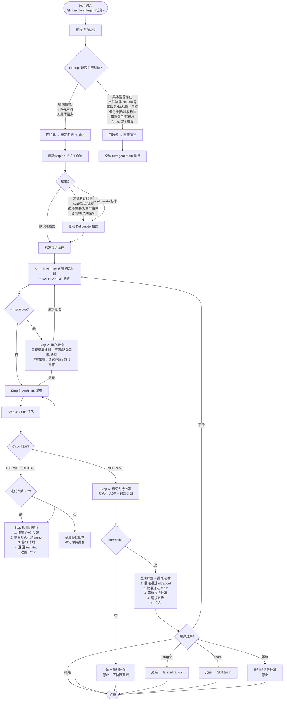
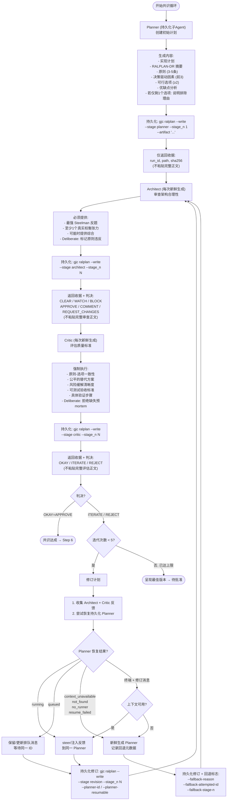
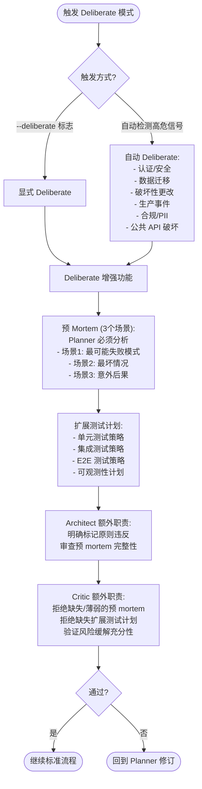
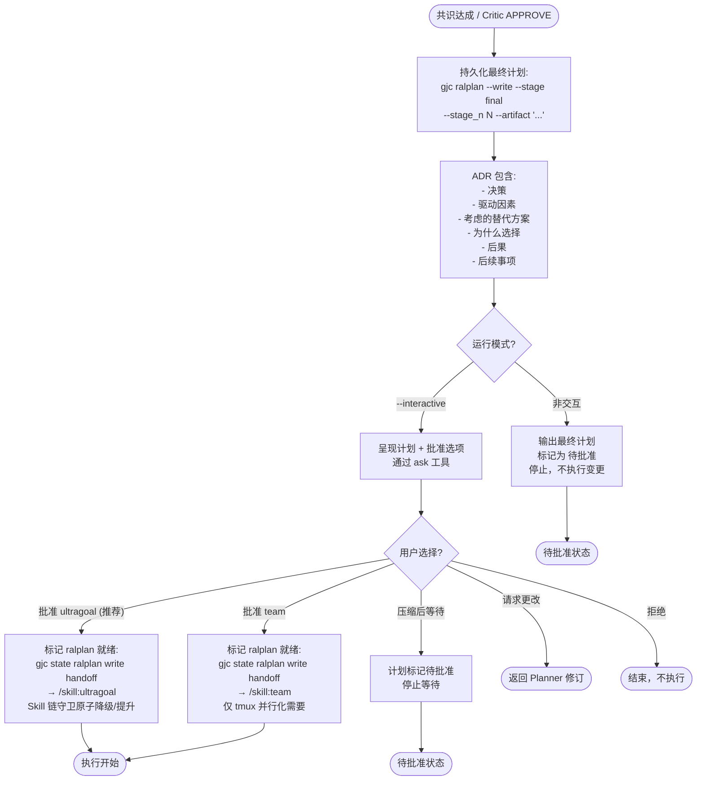

# Ralplan 流程图

> 三角色共识规划 — Planner → Architect → Critic 迭代直到共识

---

## 2a: 总览 — 预执行门 + 共识工作流

---

## 2b: 共识循环 — Planner / Architect / Critic / 修订

---

## 2c: Deliberate 模式 — 高风险工作

---

## 2d: 执行桥接 — 批准门控 + 交接

---

## 预执行门：好 vs 坏 Prompt

| 状态 | 示例 | 原因 |
|------|------|------|
| 通过 | `team fix src/hooks/bridge.ts:326` | 引用特定文件 |
| 通过 | `team implement issue #42` | 具体工作项 |
| 通过 | `team fix processKeywordDetector` | 命名特定函数 |
| 通过 | `team add validation to UserModel` | 命名特定类 |
| 通过 | `team do:\n1. Add X\n2. Test Y` | 结构化交付物 |
| 通过 | `force: team refactor auth` | 显式覆盖 |
| 拦截 | `team fix this` | 无锚点 |
| 拦截 | `team build the app` | 过于宽泛 |
| 拦截 | `team improve performance` | 无具体目标 |
| 拦截 | `team add authentication` | 无具体规格 |
