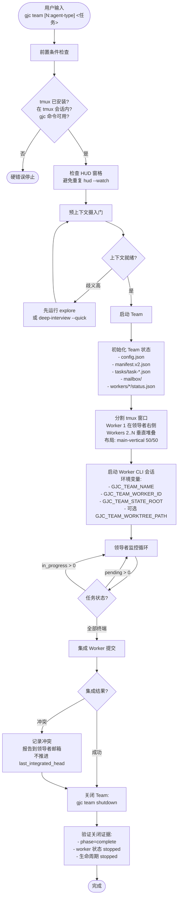
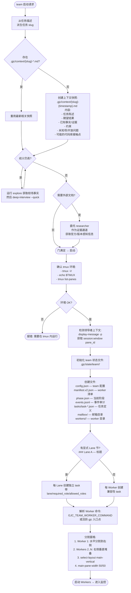
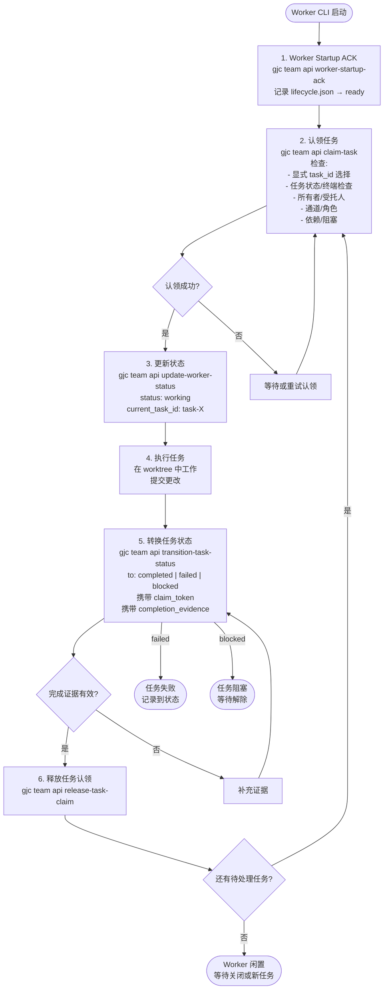
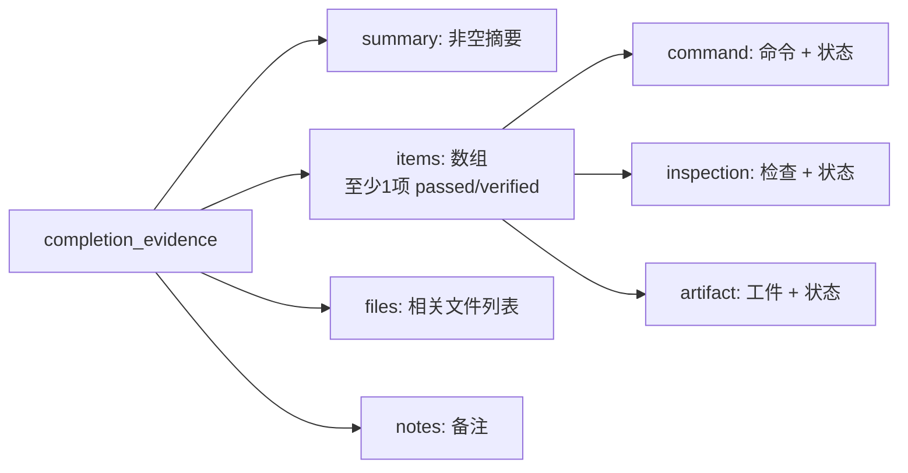
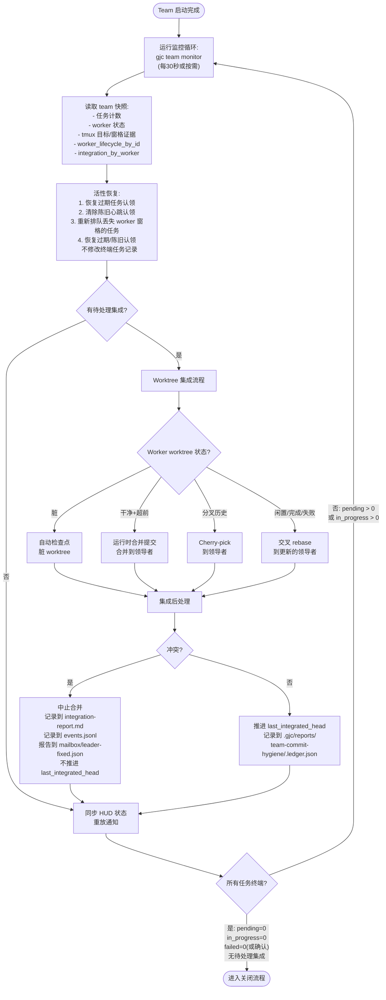
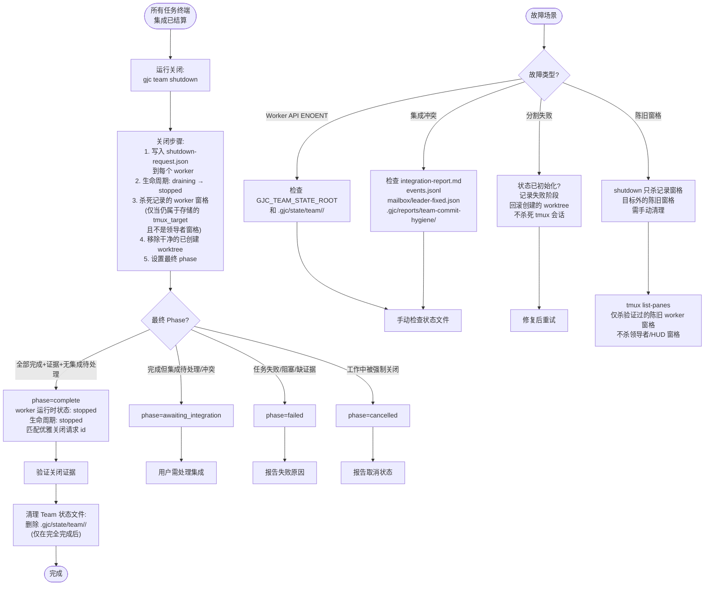

# Team 流程图

> tmux 多 Worker 并行编排 — 分割窗格、协调执行、集成结果

---

## 3a: 总览 — 从启动到关闭的完整生命周期

---

## 3b: 预上下文摄入门 + 启动流程

---

## 3c: Worker 生命周期

### 完成证据结构

---

## 3d: 领导者监控循环 + Worktree 集成

---

## 3e: 关闭 + 清理 + 故障恢复

---

## 数据平面文件参考

| 文件 | 作用 |
|------|------|
| `config.json` | Team 配置 |
| `manifest.v2.json` | Worker 清单 |
| `phase.json` | 当前阶段 |
| `events.jsonl` | 事件审计日志 |
| `trace.jsonl` | 结构化追踪 (v1) |
| `trace-errors.jsonl` | 追踪错误隔离 |
| `telemetry.jsonl` | 遥测 |
| `monitor-snapshot.json` | 监控快照 |
| `integration-report.md` | 集成报告 |
| `tasks/task-*.json` | 任务定义 + completion_evidence |
| `mailbox/<worker>/` | 每 worker 邮箱 |
| `notifications/` | 通知记录 |
| `workers/<id>/startup-ack.json` | 启动确认 |
| `workers/<id>/status.json` | Worker 报告状态 |
| `workers/<id>/lifecycle.json` | 生命周期真实来源 |
| `workers/<id>/heartbeat.json` | 心跳 |
| `workers/<id>/shutdown-request.json` | 关闭请求 |
| `workers/<id>/nudges/` | 领导者轻推记录 |
