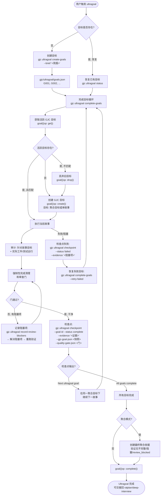
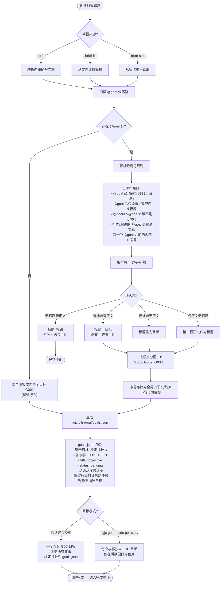
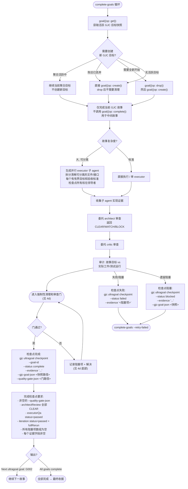
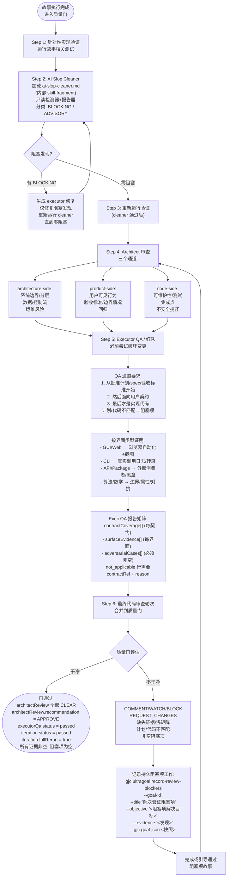
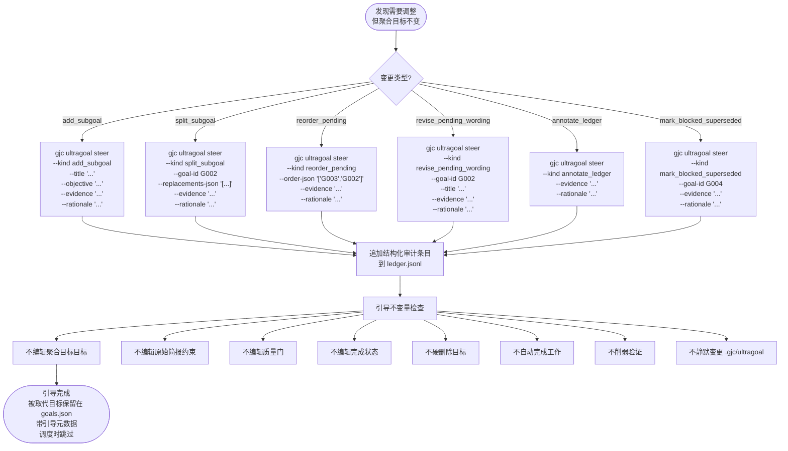

# Ultragoal 流程图

> 多目标持久化执行与验证 — 从简报创建目标到逐故事检查点完成

---

## 4a: 总览 — 从创建到完成的全流程

---

## 4b: 创建目标 — Brief 解析 + @goal 分隔符

---

## 4c: 完成目标循环 — Execute → Audit → Checkpoint

---

## 4d: 强制性完成清理和审查门

---

## 4e: 动态引导 (Steer)

---

## Ultragoal 文件参考

| 文件 | 作用 |
|------|------|
| `.gjc/ultragoal/brief.md` | 原始简报 |
| `.gjc/ultragoal/goals.json` | 目标计划 (稳定指针式) |
| `.gjc/ultragoal/ledger.jsonl` | 持久审计跟踪 (检查点+引导事件) |

## 目标工具操作

| 操作 | 用途 |
|------|------|
| `goal({op: get})` | 获取活跃 GJC 目标快照 |
| `goal({op: create})` | 创建新 GJC 目标 |
| `goal({op: complete})` | 完成目标 (仅最终) |
| `goal({op: drop})` | 丢弃活跃目标 (不清除模式) |
| `goal({op: resume})` | 重新激活暂停的目标 |

## 引导不变量

- 不要编辑聚合目标、原始约束、质量门或完成状态
- 不要硬删除目标或自动完成工作
- 不要削弱验证或静默变更 .gjc/ultragoal
- 接受/拒绝的尝试追加到 ledger.jsonl
- 被取代的目标保留在 goals.json，调度时跳过
